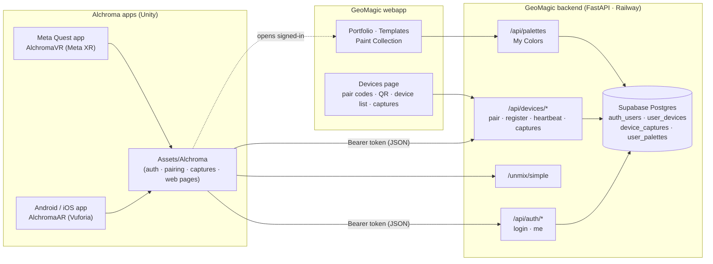
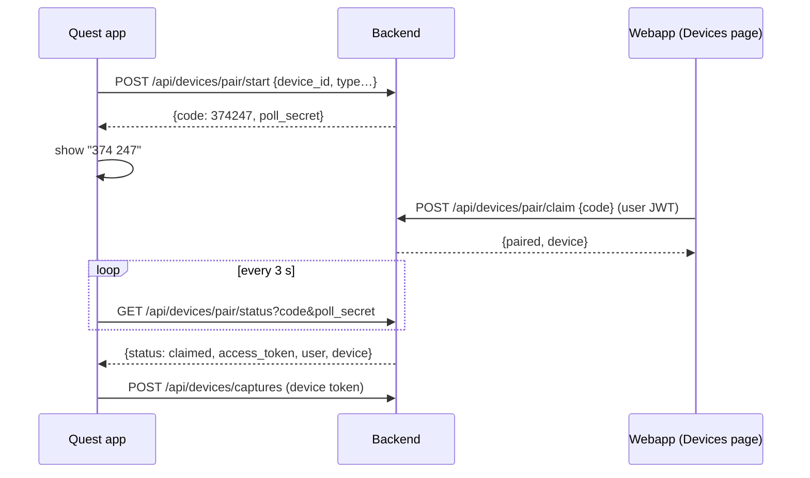

# GeoMagic ↔ Alchroma apps — integration guide

This branch connects the Alchroma apps (Android / iOS on `AlchromaAR`, Meta Quest on
`AlchromaVR`) to the GeoMagic web backend so that:

* users sign in with the **same account** as the webapp (or pair a device with a code),
* every color captured / unmixed in the apps is **saved under that account** and shows
  up on the webapp **Devices** page and in **Paint Collection → My Colors**,
* the webapp's own pages (Portfolio, Templates, Paint Collection…) can be opened from the
  app already signed in,
* a device can be **unpaired from the webapp**, which signs the app out on its next request.

Nothing needs to be added to a scene: `Assets/Alchroma/Runtime/AlchromaBootstrap.cs`
starts everything after the first scene loads.

---

## 1. Architecture

**Boundary for the app developers:** the apps only talk to `/api/auth/login`,
`/api/devices/*` and `/unmix/simple`, all through `Assets/Alchroma`. Accounts, the
database, the Devices page and the webapp pages are owned by the backend/webapp side and
need no app work.

---

## 2. How a device gets signed in

| Flow | Who types what | Used by |
|------|----------------|---------|
| **A. Code on the device** | App shows a 6-digit code → user enters it on the webapp *Devices → Pair a headset* | Quest (no typing in VR), projectors |
| **B. Code on the webapp** | Webapp shows an 8-character code + QR → user enters it in the app (*Pair with code*), scans the QR, or taps the `alchroma://pair?code=…` link | Phone, tablet |
| **C. Email + password** | Same credentials as the webapp, typed in the app | Phone, tablet |

All three end with the app holding a **device token**: a JWT for the user with a `did`
(device id) claim, valid 90 days, revocable from the Devices page. The SDK stores it in
`PlayerPrefs` and sends it as `Authorization: Bearer …` on every call.

---

## 3. Backend API used by the apps

Base URL: `https://alchromaticdemo.up.railway.app` (`AlchromaConfig.BaseUrl`, overridable at runtime).

| Method & path | Auth | Purpose |
|---------------|------|---------|
| `POST /api/auth/login` `{email,password}` | – | Same login as the webapp → user JWT |
| `POST /api/devices/register` `{device_id,device_type,platform,name,app_version}` | user or device | Register this install → **device token** |
| `POST /api/devices/pair/start` (device info) | – | Flow A: get a 6-digit code + poll secret |
| `GET /api/devices/pair/status?code&poll_secret` | – | Flow A: `pending` → `claimed` (+ session, once) → `consumed` |
| `POST /api/devices/pair/redeem` `{code, …device info}` | – | Flow B: redeem the webapp's code → device token |
| `POST /api/devices/heartbeat` | device | Keeps the device "online" on the Devices page |
| `POST /api/devices/captures` `{hex,name?,source?,recipe?,meta?}` | user or device | Save a color (also merged into *My Colors*) |
| `POST /api/devices/captures/batch` `{captures:[…]}` | user or device | Flush an offline queue |
| `GET /api/devices/captures?limit&offset&device_id&source` | user or device | The user's captures, newest first |
| `DELETE /api/devices/captures/{id}` | user or device | Delete one |
| `POST /unmix/simple` `{target_color}` | optional | Unchanged; the SDK adds the Bearer token when signed in |

`401 {"detail":"device_revoked"}` means the device was unpaired from the webapp: the SDK
clears the session and shows the sign-in overlay again.

`device_type`: `phone | tablet | headset | projector | desktop | other` ·
`platform`: `android | ios | quest | web | windows | macos | other` ·
`source`: `camera | unmix | picker | projector | web_camera | manual | other`

---

## 4. What changed in the Unity projects

### Added — `Assets/Alchroma/Runtime/` (identical on both branches)

| File | Role |
|------|------|
| `AlchromaConfig.cs` | Base URL (persisted, overridable), deep-link scheme, `AutoShowLogin`, heartbeat interval |
| `AlchromaSession.cs` | Stored token + user (`PlayerPrefs`), `Changed` event |
| `AlchromaApi.cs` | JSON client (`Get/Post/Patch/Delete`), adds the Bearer token, handles `device_revoked` |
| `AlchromaDevice.cs` | Stable per-install `device_id`, type/platform detection (`ForceType` to override) |
| `AlchromaAuth.cs` | `Login(email, password)`, `RegisterDevice()`, `Validate()`, `Logout()` |
| `AlchromaPairing.cs` | Flow A (`StartCodePairing` + polling), Flow B (`RedeemCode`, deep links), heartbeat |
| `AlchromaCaptures.cs` | `Save / List / Delete` captures, offline queue + `FlushQueue()` |
| `AlchromaWebPages.cs` | Opens Portfolio / Templates / Paint Collection signed in (system browser, or in-app with `ALCHROMA_WEBVIEW`) |
| `AlchromaWebView.cs` | Optional in-app web view (compiled only with `ALCHROMA_WEBVIEW` + gree/unity-webview) |
| `AlchromaLoginUI.cs` | Runtime-built sign-in / pairing overlay (email+password, *Pair with code*, headset code display) |
| `AlchromaBootstrap.cs` | `RuntimeInitializeOnLoadMethod`: creates the persistent `[Alchroma]` object |

### Modified

| Branch | File | Change |
|--------|------|--------|
| both | `Assets/Scripts/ColorUnmixAPI.cs` | URL comes from `AlchromaConfig`; Bearer token added when signed in |
| AR | `Assets/Scripts/CreatePaintAPI.cs` | Same public API, but saves/lists/deletes through `/api/devices/captures` (was `geomagic-backend.iapplabz.co.in`, anonymous and shared by everyone) |
| VR | `Assets/Scripts/APIsManager.cs` | Same as above |
| both | `Assets/Scripts/ColorItem.cs` | Delete goes through the manager → backend |
| AR | `Assets/Ali/UnmixColorDetector.cs` | Saves the unmixed color + recipe to the account; guards the 3-slot palette array (the API can return 4 paints) |
| VR | `Assets/Ali/Scripts/UnmixHandler.cs` | Same |
| VR | `Assets/Ali/Scripts/saveColor.cs` | Fixed two inverted null checks (`if (!colorDetector) colorDetector.SaveColor(...)`) — Save never reached the backend before |
| AR | `Assets/Plugins/Android/AndroidManifest.xml` | `alchroma://` deep-link intent filter, `exported`, `singleTask`, INTERNET |
| AR | `ProjectSettings/ProjectSettings.asset` | iOS URL scheme `alchroma` |

Public class names, method names and `Datum`/`Data` shapes are unchanged, so existing
scenes, prefabs and UnityEvents keep working. `paintListResponse` now starts as an empty
list (it used to be `null` until the network answered) and the color lists redraw when
the list arrives or the user signs in/out.

---

## 5. Building & testing

### Prerequisites (unchanged)
* `AlchromaAR`: Unity **2022.3.62f3**. `Packages/manifest.json` references Vuforia as
  `file:C:/com.ptc.vuforia.engine-11.4.4.tgz` — put that archive at that path (or edit the
  reference) or the project will not open.
* `AlchromaVR`: Unity **6000.3.10f1**. The ZED integration is referenced from a local
  folder (`file:C:/Users/123/Downloads/unity-zed-integration-main`) — same remark.

### No wiring needed
Open the project, press Play or build. On first start the sign-in overlay appears
(phones: email/password or *Pair with code*; Quest: a 6-digit code). Set
`AlchromaConfig.AutoShowLogin = false` from a `[RuntimeInitializeOnLoadMethod(RuntimeInitializeLoadType.BeforeSceneLoad)]`
if you want to show your own UI instead and call `AlchromaAuth` / `AlchromaPairing` yourself.

### Test script
1. **Phone, flow C** — start the app → sign in with a webapp account → Console shows
   `[Alchroma] POST /api/devices/register -> 200`. Webapp → Devices lists the phone as *Online*.
2. **Phone, flow B** — sign out (`AlchromaAuth.Logout()` or clear app data) → on the
   webapp Devices page tap *Get pairing code* → in the app tap *Pair with code* and type it
   (or scan the QR with the phone camera, or open the `alchroma://pair?code=…` link) → the
   overlay closes, the device appears on the Devices page.
3. **Quest, flow A** — start the app → a code is shown → enter it on the Devices page
   (*Pair a headset*) → within ~3 s the overlay closes.
4. **Capture** — pick/save a color in the app → it appears on the Devices page
   (*Captured on devices*) with the device name, and in Paint Collection → My Colors.
5. **Unmix** — run an unmix → the target color + recipe appear on the Devices page.
6. **Unpair** — on the Devices page tap *Unpair* → the next app request returns
   `device_revoked`, the app shows the sign-in overlay again.
7. **Offline** — turn off networking, save a color (it is queued), sign in / reconnect →
   the queue is flushed (`[Alchroma] Flushed N queued capture(s)`).

### Pointing a build at a local backend
`AlchromaConfig.BaseUrl = "http://192.168.1.10:8000";` (persisted in PlayerPrefs). For a
plain-http URL on Android/iOS you also need cleartext traffic allowed in the manifest /
ATS exception — production is https, so leave that out of release builds.

### Optional: in-app web view
1. `Packages/manifest.json`: `"net.gree.unity-webview": "https://github.com/gree/unity-webview.git?path=/dist/package-nofragment"`
2. Player Settings → Scripting Define Symbols: `ALCHROMA_WEBVIEW`
3. `AlchromaWebPages.OpenPortfolio()` now opens inside the app with a *Close* bar.
   Without the define the same call opens the system browser, already signed in.

---

## 6. Notes / follow-ups

* The webapp session for the in-app pages is passed through `oauth-callback.html?token=…`
  (same mechanism the Google/Facebook login already uses). If that is a concern later,
  swap it for a one-time exchange code.
* Deep links: Android is handled by the manifest intent filter; iOS by the `alchroma` URL
  scheme in Player Settings. Quest does not need deep links (flow A).
* `Assets/Alchroma` has no `.meta` files in this branch; Unity generates them on first
  import — commit them with your next change.
* Paid assets (AVProVideo, OpenCVForUnity) are untouched by this integration.
